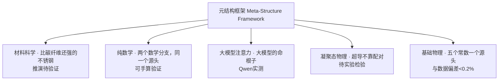

# 大模型的"命根子"：拆掉10%，它崩溃136倍

*Part of **云韶AI研究院（YUNSHAO AI Research）** 系列 — 元结构框架在大模型注意力（large language model attention）领域的投影。本系列共5篇独立论文，各自自成证据链，详见文末「本系列全貌」。*

**We mapped which attention heads are load-bearing. Remove 10% of them — the model breaks 136×.**

大模型里成千上万个注意力头，哪些是承重墙？这篇论文给出了地图——并且用 Qwen2.5-0.5B 和 7B 实测验证：

拆掉识别出的"骨架头"，模型困惑度崩溃 **136倍到5000倍以上**；拆同样比例的冗余头，几乎没影响。当你压缩、剪枝、量化一个模型时，先知道哪堵墙不能拆。

## 这篇讲了什么 / What's inside

- 四种边结构：真实边（骨架）/ 虚拟边（长程捷径）/ 残缺边（盲区诊断）/ 弯曲边（突破死路）
- 稀疏注意力：结构判据全面胜过范数判据，困惑度最低降 **38.3%**
- 骨架识别尺度不变：0.5B 与 7B 行为规律一致
- KV缓存按结构集中度分配：75%保留比最优，降7.9%；反向分配反而升27.2%
- 完整数学公式（7.1–7.5）+ 可移植Python实现（8.1–8.5）

## 实验代码 · Code

本仓库 `exp/` 目录包含论文**全部实验的完整代码、语料与原始结果数据**（66个文件）——下载开源模型（ModelScope/HuggingFace 搜 Qwen2.5-0.5B-Instruct）→ 改 `MODEL_PATH` → 直接跑，即可完整复现论文每一张表格。

详见 [`exp/REPRODUCE.md`](exp/REPRODUCE.md)。

## Files · 文件

| Language | File |
|----------|------|
| 中文 | 哈密顿LLM注意力增强·专业重制版-对外学术-20260819.pdf |
| English | Long-Context-LLM-Attention-Hamiltonian-Virtual-Edges-EN-20260819.pdf |

## 本系列全貌 · 云韶AI研究院 YUNSHAO AI Research Series

一个元结构框架，五个领域的独立投影。每一篇都自成证据链、可独立验证——任何一篇被质疑时，框架仍在。

| # | 领域 | 论文 | 仓库 | 验证状态 |
|---|------|------|------|---------|
| 1 | 材料科学 | 比碳纤维还强的不锈钢 | [Steel-Stronger-Than-Carbon-Fiber](https://github.com/dadaosizhishi2026/Steel-Stronger-Than-Carbon-Fiber) | 推演待验证 |
| 2 | 纯数学 | 两个数学分支，同一个源头 | [Hidden-Unity-of-Math](https://github.com/dadaosizhishi2026/Hidden-Unity-of-Math) | 可手算验证 |
| 3 | 大模型注意力 | 大模型的命根子 | [LLM-Lifelines](https://github.com/dadaosizhishi2026/LLM-Lifelines) | Qwen实测 |
| 4 | 凝聚态物理 | 超导不靠配对 | [Superconductivity-Beyond-Pairing](https://github.com/dadaosizhishi2026/Superconductivity-Beyond-Pairing) | 待实验检验 |
| 5 | 基础物理 | 五个常数一个源头 | [Five-Constants-One-Source](https://github.com/dadaosizhishi2026/Five-Constants-One-Source) | 与数据偏差<0.2% |

*Academic exchange only. All thresholds are tunable parameters; full reproduction instructions included.*

*仅供学术交流。全部阈值为可调参数，附完整复现说明。*
